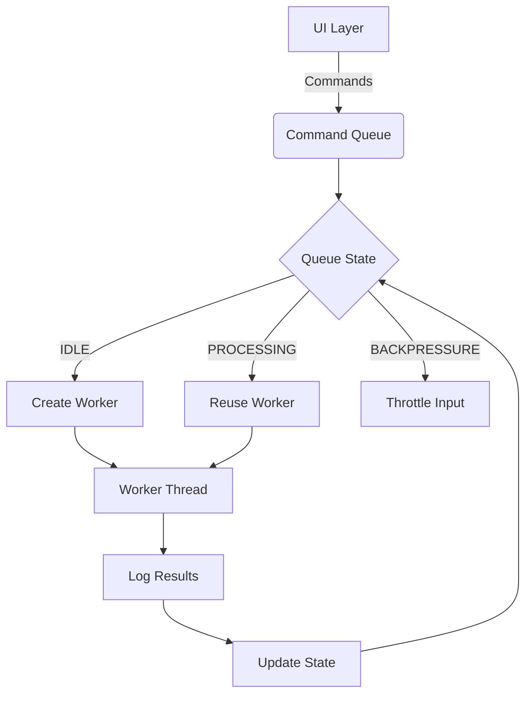

# Unified Command System Architecture

## Overview
This document outlines the architecture for command processing, focusing on consistent queuing, execution, and logging across different command types (e.g., FBC, RPC). It integrates command queue management with robust error handling and traceability.

## Command Queue Architecture

### Flow Diagram

### Components
| Component | Details |
|-----------|---------|
| Command Queue | Thread-safe FIFO (deque), atomic Lock, states (idle/processing/backpressure), max 1000 |
| Worker Management | Dynamic pooling; lifecycle: dequeue→execute→signal→cleanup |

### State Transitions
| From | To | Trigger |
|-----|----|---------|
| Idle | Processing | Commands received |
| Processing | Backpressure | Queue >800 |
| Backpressure | Processing | Queue <200 |
| Processing | Idle | Queue empty |

### Performance
| Metric | Value |
|--------|-------|
| Throughput | 1500 cmd/s |
| Latency | <50ms p95 |
| Max Depth | 1000 |
| Memory | <2MB/1000 cmd |

### Failure Handling
| Strategy | Details |
|----------|---------|
| Retries | Transient errors |
| Dead Letter | Failed cmds |
| Circuit Breaker | Node outages |

## Command Processing Flow

### Background/Fixes
| Aspect | Issue | Fix | Impact |
|--------|-------|-----|--------|
| FBC Commands | Not written to files, explicit start_processing() | Remove call, align w/RPC flow | Consistent queuing/output/logging |
| RPC Output | No dedicated logs, log_path not populated | Populate via NodeManager._generate_log_path in get_token | Traceability/auditability |

### Verification
New test: tests/commander/test_rpc_log_path.py (passes).

### Future Plans
- Async batch processing
- Unified cmd interface
- Timeout policies