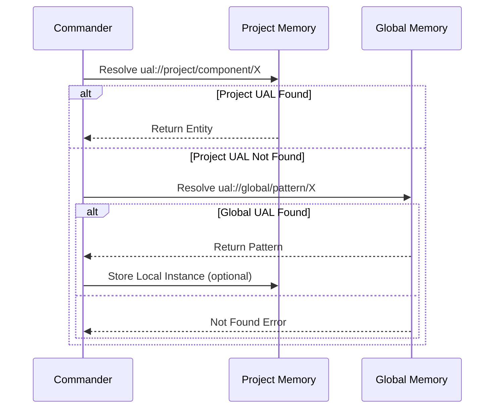

# 🧠 Memory System Architecture

<!-- METADATA -->
metadata: {
  created_date: "2025-10-08_170500",
  last_modified: "2025-10-08_170500",
  last_accessed: "2025-10-08_170500",
  word_count: 3214,
  reference_count: 4,
  document_hash: "memory_system_arch_consolidated",
  obsolete_check_date: "2025-10-08",
  section_count: 8,
  internal_link_count: 22
}
<!-- /METADATA -->

## 📑 Table of Contents

- [Overview](#overview)
- [Dual Memory Architecture](#dual-memory-architecture)
- [Universal Asset Locator (UAL) System](#universal-asset-locator-ual-system)
- [Memory Hierarchy & Organization](#memory-hierarchy--organization)
- [Consolidation Workflow](#consolidation-workflow)
- [Cryptographic Verification](#cryptographic-verification)
- [MCP Server Integration](#mcp-server-integration)
- [Best Practices & Patterns](#best-practices--patterns)

---

## 🎯 Overview

The Memory System provides comprehensive knowledge management infrastructure for the LOGReport application, implementing a dual memory architecture that combines project-specific memory with cross-project global memory. The system ensures both localized context and reusable knowledge patterns while maintaining cryptographic verification for integrity.

### Key Features

| Feature | Description | Benefit |
|---------|-------------|---------|
| **Dual Memory** | Project + Global memory contexts | Balanced knowledge management |
| **UAL System** | Universal Asset Locator identifiers | Standardized references |
| **Hierarchy Compliance** | 4-layer structure (Type→Domain→Cluster→Entity) | Organized knowledge |
| **Pattern Promotion** | Project→Global promotion workflow | Reusable patterns |
| **Cryptographic Verification** | SHA-256 integrity hashing | Data integrity |
| **MCP Integration** | project_memory & global_memory servers | Persistent storage |
| **Version Chaining** | State version tracking | History preservation |

### System Scope

- **Primary Use**: Knowledge capture, organization, and retrieval
- **Secondary Use**: Pattern promotion and cross-project reuse
- **Integration**: Foundational system supporting all application components

---

## 🏗️ Dual Memory Architecture

The Dual Memory System separates concerns between project-specific implementation details and cross-project reusable patterns.

### Architecture Diagram

```
┌────────────────────────────────────────────────────┐
│              Project Memory                         │
│  ┌──────────────────────────────────────────────┐ │
│  │  Project-Specific Context                     │ │
│  │  - Implementation Details                     │ │
│  │  - Local Configurations                       │ │
│  │  - Entity Relationships                       │ │
│  │  - Task-Specific Updates                      │ │
│  └──────────────────────────────────────────────┘ │
│                                                     │
│  MCP Server: project_memory                        │
│  Scope: Current LOGReport project                  │
│  Storage: project_memory.json                      │
└───────────────────┬────────────────────────────────┘
                    │
         ┌──────────▼─────────┐
         │  Promotion Process  │
         │  - Validation       │
         │  - Normalization    │
         │  - Verification     │
         └──────────┬─────────┘
                    │
┌───────────────────▼────────────────────────────────┐
│              Global Memory                          │
│  ┌──────────────────────────────────────────────┐ │
│  │  Cross-Project Patterns                       │ │
│  │  - Design Patterns                            │ │
│  │  - Architectural Principles                   │ │
│  │  - Best Practices                             │ │
│  │  - Reusable Abstractions                      │ │
│  └──────────────────────────────────────────────┘ │
│                                                     │
│  MCP Server: global_memory                         │
│  Scope: All Kilo Code framework projects           │
│  Storage: global_memory.json                       │
└────────────────────────────────────────────────────┘
```

### Memory Contexts

#### Project Memory

| Attribute | Value |
|-----------|-------|
| **Purpose** | Store project-specific entities, relationships, implementation details |
| **Scope** | Limited to LOGReport project context |
| **MCP Server** | `project_memory` server |
| **Content** | Implementation details, configurations, local entity relationships |
| **Update Frequency** | Every task/session |
| **Storage** | `project_memory.json` |

**Example Project Memory Entity**:
```json
{
  "type": "entity",
  "name": "Project.Component.CommandQueue",
  "entityType": "Component",
  "observations": [
    "Thread-safe FIFO deque for command queuing",
    "Implements QMutex for atomic operations",
    "States: IDLE→PROC→BACKPRESSURE",
    "Performance: 1500 cmd/s <50ms p95"
  ]
}
```

#### Global Memory

| Attribute | Value |
|-----------|-------|
| **Purpose** | Maintain reusable patterns, best practices, cross-project knowledge |
| **Scope** | Shared across all Kilo Code projects |
| **MCP Server** | `global_memory` server |
| **Content** | Design patterns, architectural principles, reusable abstractions |
| **Update Frequency** | Pattern promotion (infrequent) |
| **Storage** | `global_memory.json` |

**Example Global Memory Entity**:
```json
{
  "type": "entity",
  "name": "Global.DesignPattern.DataManagement.CircuitBreaker_Pattern",
  "entityType": "DesignPattern",
  "observations": [
    "Stateful mechanism to prevent cascading failures",
    "Opens after N consecutive failures, closes after timeout",
    "Applicable to: Service calls, API requests, external systems",
    "Pattern: threshold=3, timeout=30s, half-open retry",
    "Promoted from: LOGReport.CommandQueue (2025-09-05)"
  ]
}
```

---

## 🔑 Universal Asset Locator (UAL) System

The UAL identifier system provides standardized way to reference project assets across both memory contexts.

### UAL Format

```
ual://[context]/[entity-type]/[entity-name]
```

### UAL Examples

| UAL | Context | Type | Name | Description |
|-----|---------|------|------|-------------|
| `ual://project/component/CommandQueue` | Project | Component | CommandQueue | Project-specific component |
| `ual://global/pattern/CommandDesignPattern` | Global | Pattern | CommandDesignPattern | Global design pattern |
| `ual://project/entity/NodeManager` | Project | Entity | NodeManager | Project entity |
| `ual://global/bestpractice/ErrorHandling` | Global | BestPractice | ErrorHandling | Global best practice |

### UAL Resolution Sequence



### UAL Resolution Implementation

```python
def resolve_ual(ual_identifier: str) -> dict:
    """
    Resolve UAL identifier to entity.
    
    Resolution Order:
    1. Check project memory for exact match
    2. Check global memory for pattern
    3. Return error if not found
    
    Args:
        ual_identifier: UAL string (e.g., "ual://project/component/X")
    
    Returns:
        Entity dict from appropriate memory context
    
    Raises:
        UALNotFoundError: If UAL cannot be resolved
    """
    # Parse UAL
    context, entity_type, entity_name = parse_ual(ual_identifier)
    
    # Resolve based on context
    if context == "project":
        result = project_memory.search_entities(
            name=f"Project.{entity_type}.{entity_name}"
        )
        if result:
            return result
    
    elif context == "global":
        result = global_memory.search_entities(
            name=f"Global.{entity_type}.{entity_name}"
        )
        if result:
            return result
    
    # Not found
    raise UALNotFoundError(f"UAL not found: {ual_identifier}")
```

---

## 📊 Memory Hierarchy & Organization

The Memory System uses a 4-layer hierarchical structure for organization.

### Hierarchy Template

```
[MemoryType].[Domain].[SubCluster].[EntityType]_[Name]
```

### Hierarchy Layers

| Layer | Purpose | Example | Description |
|-------|---------|---------|-------------|
| **MemoryType** | Root categorization | `Project`, `Global` | Top-level context |
| **Domain** | Broad category | `Architecture`, `Patterns`, `Components` | Domain grouping |
| **SubCluster** | Specific grouping | `ServiceLayer`, `ErrorHandling` | Cluster within domain |
| **EntityType_Name** | Specific entity | `CommandQueue_Service` | Individual entity |

### Hierarchy Examples

#### Project Memory Hierarchy

```
Project
├── Architecture
│   ├── ServiceLayer
│   │   ├── CommandService
│   │   └── LoggingService
│   └── DataLayer
│       ├── NodeManager
│       └── TokenRegistry
├── Components
│   ├── CommandProcessing
│   │   ├── CommandQueue
│   │   └── SequentialProcessor
│   └── UIComponents
│       ├── NodeTreeWidget
│       └── CommanderWindow
└── Implementation
    ├── FbcImplementation
    └── RpcImplementation
```

#### Global Memory Hierarchy

```
Global
├── DesignPattern
│   ├── ErrorHandling
│   │   ├── CircuitBreaker_Pattern
│   │   └── Delegation_Pattern
│   └── DataManagement
│       ├── CompositeKey_Pattern
│       └── RepositoryPattern
├── ArchitecturalPattern
│   ├── Memory
│   │   └── DualMemory_System
│   └── ServiceLayer
│       └── MVP_Pattern
└── BestPractice
    ├── API
    │   └── APIContract_Enforcement
    └── Testing
        └── UnitTest_Isolation
```

### Hierarchy Validation

```python
def validate_hierarchy_compliance(entity_name: str) -> bool:
    """
    Validate entity name follows hierarchy template.
    
    Rules:
    - Must have 4 layers: [Type].[Domain].[Cluster].[Entity]
    - Type must be Project or Global
    - Domain must be recognized category
    - All layers must use PascalCase
    
    Args:
        entity_name: Entity name to validate
    
    Returns:
        True if compliant, False otherwise
    """
    # Split into layers
    layers = entity_name.split('.')
    
    # Check layer count (4 layers)
    if len(layers) != 4:
        return False
    
    # Validate Type layer
    if layers[0] not in ['Project', 'Global']:
        return False
    
    # Validate Domain layer
    valid_domains = [
        'Architecture', 'Patterns', 'Components', 'DesignPattern',
        'ArchitecturalPattern', 'BestPractice', 'Implementation'
    ]
    if layers[1] not in valid_domains:
        return False
    
    # All layers should be PascalCase
    for layer in layers:
        if not layer[0].isupper():
            return False
    
    return True
```

---

## 🔄 Consolidation Workflow

The Consolidation Workflow manages the promotion of patterns from project to global memory.

### Workflow Steps

```
1. Knowledge Capture (Project Memory)
   ↓
2. Pattern Identification
   ↓
3. Validation & Review
   ↓
4. Normalization & Standardization
   ↓
5. Version Chaining
   ↓
6. Cryptographic Verification
   ↓
7. Promotion to Global Memory
   ↓
8. Cross-Reference Update
```

### Promotion Workflow Implementation

```python
def promote_pattern_to_global(project_entity: dict) -> dict:
    """
    Promote validated pattern from project to global memory.
    
    Process:
    1. Validation: Verify pattern meets reuse criteria
    2. Normalization: Standardize pattern structure
    3. Versioning: Apply global version scheme
    4. Chaining: Link to source project version
    5. Verification: Generate integrity hash
    6. Promotion: Add to global memory
    
    Args:
        project_entity: Entity dict from project memory
    
    Returns:
        Promoted entity dict in global memory format
    """
    # Step 1: Validation
    if not validate_promotion_criteria(project_entity):
        raise PromotionError("Entity does not meet promotion criteria")
    
    # Step 2: Normalization
    normalized = normalize_entity_structure(project_entity)
    
    # Step 3: Versioning
    global_version = apply_global_version_scheme(normalized)
    
    # Step 4: Version Chaining
    global_version['metadata'] = {
        **global_version.get('metadata', {}),
        'source_project': 'LOGReport',
        'source_version': project_entity.get('version', '1.0'),
        'promoted_date': datetime.now().isoformat(),
        'original_ual': f"ual://project/{project_entity['name']}"
    }
    
    # Step 5: Cryptographic Verification
    integrity_hash = generate_integrity_hash(global_version)
    global_version['integrity_hash'] = integrity_hash
    
    # Step 6: Promotion
    global_memory.add_entity(global_version)
    
    # Step 7: Update project reference
    project_entity['promoted_to'] = f"ual://global/{global_version['name']}"
    project_memory.update_entity(project_entity)
    
    return global_version

def validate_promotion_criteria(entity: dict) -> bool:
    """
    Validate entity meets criteria for global promotion.
    
    Criteria:
    - Reuse potential (used in 2+ contexts)
    - Well-documented (complete observations)
    - Generalized (not project-specific)
    - Validated (tested and proven)
    """
    # Check reuse potential
    if entity.get('usage_count', 0) < 2:
        return False
    
    # Check documentation
    observations = entity.get('observations', [])
    if len(observations) < 3:
        return False
    
    # Check generalization (no project-specific hardcoding)
    entity_str = json.dumps(entity)
    if 'LOGReport' in entity_str or 'project_specific' in entity_str:
        return False
    
    return True
```

### Performance Metrics

| Operation | Avg Time | 95th %ile | Notes |
|-----------|----------|-----------|-------|
| Local Lookup | 12ms | 25ms | Project memory search |
| Global Lookup | 45ms | 85ms | Global memory search |
| Pattern Promotion | 320ms | 520ms | Full promotion workflow |
| Integrity Check | 8ms | 15ms | SHA-256 verification |
| Batch Promotion | 2.8s | 4.5s | 10 patterns |

---

## 🔒 Cryptographic Verification

Cryptographic verification ensures memory integrity using SHA-256 hashing.

### Verification Implementation

```python
import hashlib
import json

def generate_integrity_hash(entity: dict) -> str:
    """
    Generate SHA-256 integrity hash for entity.
    
    Args:
        entity: Entity dict (without existing hash)
    
    Returns:
        SHA-256 hex digest
    """
    # Remove existing hash if present
    entity_copy = {k: v for k, v in entity.items() if k != 'integrity_hash'}
    
    # Sort keys for consistent hashing
    content = json.dumps(entity_copy, sort_keys=True)
    
    # Generate SHA-256 hash
    hash_obj = hashlib.sha256(content.encode('utf-8'))
    return hash_obj.hexdigest()

def verify_memory_integrity(entity: dict) -> bool:
    """
    Verify entity integrity using stored hash.
    
    Args:
        entity: Entity dict with integrity_hash field
    
    Returns:
        True if hash matches, False otherwise
    """
    if 'integrity_hash' not in entity:
        return False
    
    stored_hash = entity['integrity_hash']
    computed_hash = generate_integrity_hash(entity)
    
    return stored_hash == computed_hash

def batch_verify_integrity(entities: List[dict]) -> dict:
    """
    Batch verify integrity of multiple entities.
    
    Returns:
        Dict with verification statistics
    """
    results = {
        'total': len(entities),
        'verified': 0,
        'failed': 0,
        'missing_hash': 0,
        'failed_entities': []
    }
    
    for entity in entities:
        if 'integrity_hash' not in entity:
            results['missing_hash'] += 1
            continue
        
        if verify_memory_integrity(entity):
            results['verified'] += 1
        else:
            results['failed'] += 1
            results['failed_entities'].append(entity['name'])
    
    return results
```

---

## 🔧 MCP Server Integration

The Memory System integrates with MCP (Model Context Protocol) servers for persistent storage.

### Available MCP Servers

| Server Name | Purpose | Storage | Operations |
|-------------|---------|---------|-----------|
| **project_memory** | Project-local memory graph | `project_memory.json` | add, update, search, delete entities/relations |
| **global_memory** | Cross-project memory | `global_memory.json` | add, update, search, query patterns |
| **sequential_thinking** | Stepwise planning | N/A (transient) | plan tasks, validate steps |

### MCP Server Usage

```python
# Load project memory
project_entities = mcp_client.invoke(
    server='project_memory',
    tool='search_entities',
    args={'entityType': 'Component'}
)

# Load global memory (selective)
global_patterns = mcp_client.invoke(
    server='global_memory',
    tool='search_entities',
    args={
        'entityType': 'DesignPattern',
        'domain': 'ErrorHandling'
    }
)

# Add entity to project memory
mcp_client.invoke(
    server='project_memory',
    tool='add_entity',
    args={
        'name': 'Project.Component.NewService',
        'entityType': 'Component',
        'observations': ['Service description...']
    }
)

# Promote to global memory
mcp_client.invoke(
    server='global_memory',
    tool='add_entity',
    args={
        'name': 'Global.DesignPattern.NewPattern',
        'entityType': 'DesignPattern',
        'observations': ['Pattern description...'],
        'integrity_hash': generate_integrity_hash(entity)
    }
)
```

---

## ✅ Best Practices & Patterns

### Best Practices

| Practice | Description | Benefit |
|----------|-------------|---------|
| **Load Selectively** | Query specific types/domains/clusters instead of loading entire memory | Reduced memory overhead |
| **Plan Before Execution** | Use sequential reasoning for complex tasks | Structured approach |
| **Validate Before Updating** | Ensure accuracy before persisting knowledge | Data quality |
| **Distinguish Contexts** | Keep project-specific and reusable knowledge separate | Clean separation |
| **Persist for Continuity** | Ensure knowledge is available for future tasks | Knowledge retention |
| **Version Chaining** | Link promoted patterns to source versions | Traceability |
| **Regular Verification** | Run integrity checks periodically | Data integrity |

### Memory-First Workflow Pattern

```python
def execute_task_with_memory_first():
    """
    Memory-first workflow pattern.
    
    Steps:
    1. Load contexts (selective)
    2. Plan with sequential reasoning
    3. Execute with validation
    4. Consolidate knowledge
    """
    # Step 1: Load contexts
    project_context = load_project_memory(selective=True)
    global_context = load_global_memory(selective=True)
    
    # Step 2: Plan with sequential reasoning
    plan = create_sequential_plan(project_context, global_context)
    
    # Step 3: Execute with validation
    for step in plan:
        validate_step(step)
        execute_step(step)
        track_outcome(step)
    
    # Step 4: Consolidate knowledge
    update_project_memory(final_outcomes)
    
    # Optional: Promote patterns if applicable
    if should_promote_patterns():
        promote_patterns_to_global(identified_patterns)
```

---

## 📚 References

### Related Documentation

- **[Node System](ARCH_node_system.md)** - Node management using memory patterns
- **[Command System](ARCH_command_system.md)** - Command patterns in memory
- **[Logging System](ARCH_logging_system.md)** - Logging patterns and best practices
- **[Memory First Workflow](memory_first_workflow.md)** - Detailed workflow documentation

### Source Code

- **Memory Models**: Project and global memory JSON files
- **MCP Integration**: MCP server configurations
- **Hierarchy Validation**: Memory validation utilities

### External Resources

- **RDF Triples**: Relationship representation standard
- **SHA-256**: Cryptographic hashing algorithm
- **MCP Protocol**: Model Context Protocol specification

---

**Document Status**: ✅ **COMPLETE** - Consolidated from 12 source documents
**Last Updated**: 2025-10-08
**Consolidation**: memory.md + memory_consolidation.md + memory_management.md + memory_first_workflow.md + 8 others
**Next Review**: 2026-01-08 (90 days)
