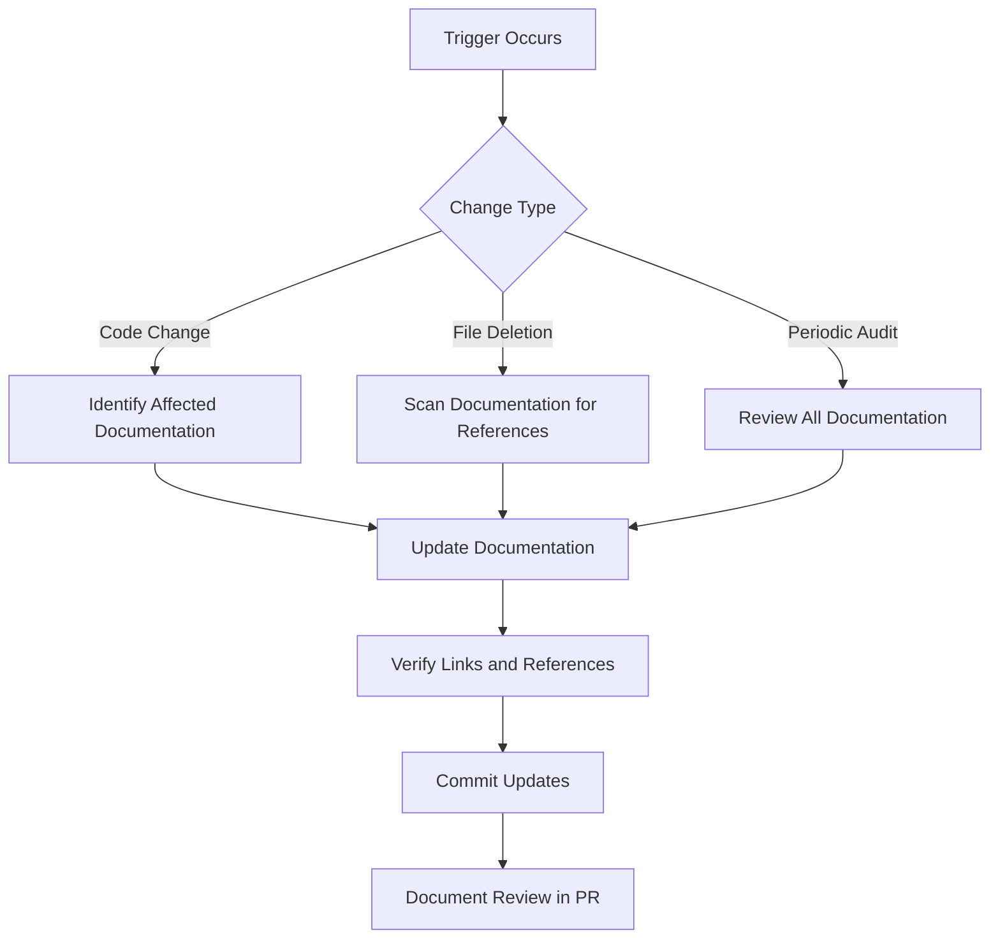

# Documentation Review Process Blueprint

## Objective
Establish a systematic process to ensure documentation remains accurate and up-to-date with the codebase, preventing reference drift.

## ⚡ Review Triggers
| Trigger | Details | Frequency/Event |
|---|---|---|
| **Code Changes** | File paths, API signatures, core functionality, config structures | Any modification |
| **File Deletions** | Removal of referenced source files | On deletion |
| **Periodic Audits** | Comprehensive documentation review | Quarterly |
| **Release Milestones** | Before major/minor releases | Pre-release |

## Review Process


### ✅ Documentation Verification Steps
| Step | Details | Tool/Action |
|---|---|---|
| **Cross-reference check** | Validate file paths, line numbers, function/class references | Manual/Automated |
| **Automated scanning** | Run documentation link validator | `python scripts/verify_documentation_links.py` |
| **Content review** | Ensure technical accuracy vs. current implementation | Manual |
| **Troubleshooting guide update** | Add/remove issues based on current system | Manual |

## Roles & Responsibilities
| Role | Responsibilities |
|------|------------------|
| Developer | Update documentation with code changes |
| Tech Lead | Review documentation in PRs |
| Architect | Conduct quarterly audits |
| QA Engineer | Verify documentation during release testing |

## Integration with Development Workflow
1. Add documentation review checklist to PR template:
   ```markdown
   ### Documentation
   - [ ] Updated affected documentation
   - [ ] Verified all code references
   - [ ] Added troubleshooting notes if needed
   ```
2. Add automated documentation check to CI pipeline:
   ```yaml
   - name: Verify Documentation Links
     run: python scripts/verify_documentation_links.py
   ```

## 🤖 Automated Verification Script (`verify_documentation_links.py`)
| Functionality | Details |
|---|---|
| **Scan** | All documentation files |
| **Extract** | Code references (file paths, line numbers) |
| **Verify** | Existence of referenced files/lines |
| **Report** | Generate report of broken references |

## Maintenance Schedule
| Activity | Frequency | Owner |
|----------|-----------|-------|
| Full documentation audit | Quarterly | Architect |
| Reference verification | Monthly | Tech Lead |
| Troubleshooting guide update | Bi-weekly | QA Engineer |

## Metrics & Monitoring
- % of PRs with documentation updates
- # of broken references per audit
- Documentation update cycle time