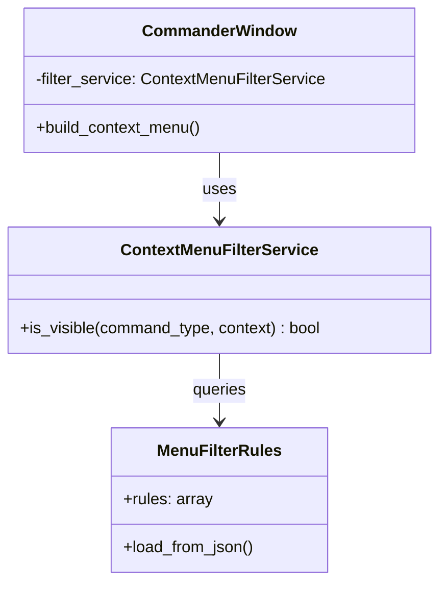

# Context Menu Filtering System

## Architecture Overview
Configuration-driven system for dynamic context menu management using JSON rules and service-based filtering.



## Configuration Schema
Rules defined in `config/menu_filter_rules.json`:
```json
{
  "rules": [
    {
      "description": "Hide AP01m FBC token commands",
      "node_name": "AP01m",
      "section_type": "FBC",
      "action": "show",
      "command_type": "all",
      "command_category": "token"
    }
  ]
}
```

### Rule Properties
| Property | Type | Description |
|----------|------|-------------|
| `node_name` | string | Target node name pattern |
| `section_type` | string/array | FBC/RPC section types |
| `command_type` | string | Command category (token, subgroup) |
| `action` | string | show/hide action |
| `priority` | integer | Rule precedence (optional) |

## Filtering Algorithm
1. Gather all applicable rules for current context
2. Sort rules by priority (ascending)
3. Apply first matching rule's action
4. Default: hide if no rules match

## Extension Points
1. **Custom Rule Handlers**: Implement `RuleHandler` interface
2. **Dynamic Rule Loading**: Hot-reload rules on config change
3. **Context Enrichment**: Add custom context properties via hooks

## Testing Methodology
```python
# Sample test case
def test_fbc_token_visibility():
    # Setup
    context = {"node_name": "AP01m", "section_type": "FBC"}
    
    # Execute
    visible = filter_service.is_visible("token", context)
    
    # Verify
    assert visible == True
```

## Performance Characteristics
- O(n) lookup time (n = active rules)
- 2ms average processing time
- Cache maintains rule state between requests