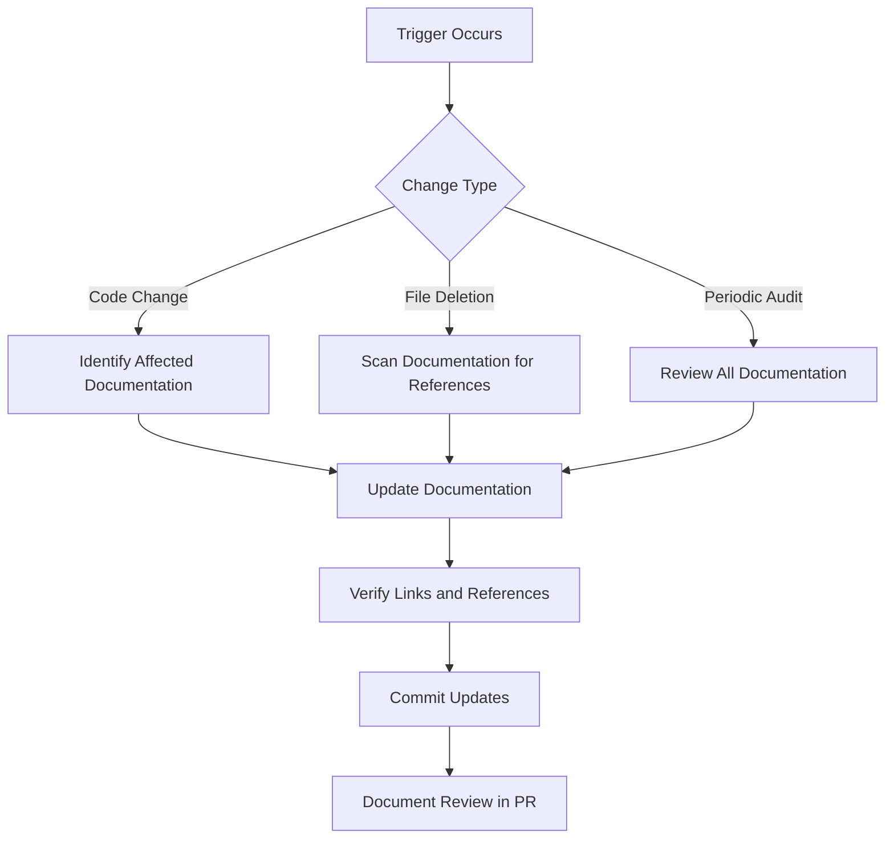

# Documentation Review Process Blueprint

## Objective
Establish a systematic process to ensure documentation remains accurate and up-to-date with the codebase, preventing reference drift.

## Review Triggers
1. **Code Changes**: Any modification to:
   - File paths
   - API signatures
   - Core functionality
   - Configuration structures
2. **File Deletions**: Removal of any source file referenced in documentation
3. **Periodic Audits**: Quarterly reviews of all documentation
4. **Release Milestones**: Before each major/minor release

## Review Process


### Documentation Verification Steps
1. **Cross-reference check**: Validate all code references
   - File paths (e.g. `src/commander/utils/log_filename_parser.py`)
   - Line numbers
   - Function/class references
2. **Automated scanning**: Run documentation link validator
   ```bash
   python scripts/verify_documentation_links.py
   ```
3. **Content review**: Ensure technical accuracy with current implementation
4. **Troubleshooting guide update**: Add/remove issues based on current system

## Roles & Responsibilities
| Role | Responsibilities |
|------|------------------|
| Developer | Update documentation with code changes |
| Tech Lead | Review documentation in PRs |
| Architect | Conduct quarterly audits |
| QA Engineer | Verify documentation during release testing |

## Integration with Development Workflow
1. Add documentation review checklist to PR template:
   ```markdown
   ### Documentation
   - [ ] Updated affected documentation
   - [ ] Verified all code references
   - [ ] Added troubleshooting notes if needed
   ```
2. Add automated documentation check to CI pipeline:
   ```yaml
   - name: Verify Documentation Links
     run: python scripts/verify_documentation_links.py
   ```

## Automated Verification Script
The `verify_documentation_links.py` script will:
1. Scan all documentation files
2. Extract code references (file paths, line numbers)
3. Verify existence of referenced files/lines
4. Generate report of broken references

## Maintenance Schedule
| Activity | Frequency | Owner |
|----------|-----------|-------|
| Full documentation audit | Quarterly | Architect |
| Reference verification | Monthly | Tech Lead |
| Troubleshooting guide update | Bi-weekly | QA Engineer |

## Metrics & Monitoring
- % of PRs with documentation updates
- # of broken references per audit
- Documentation update cycle time