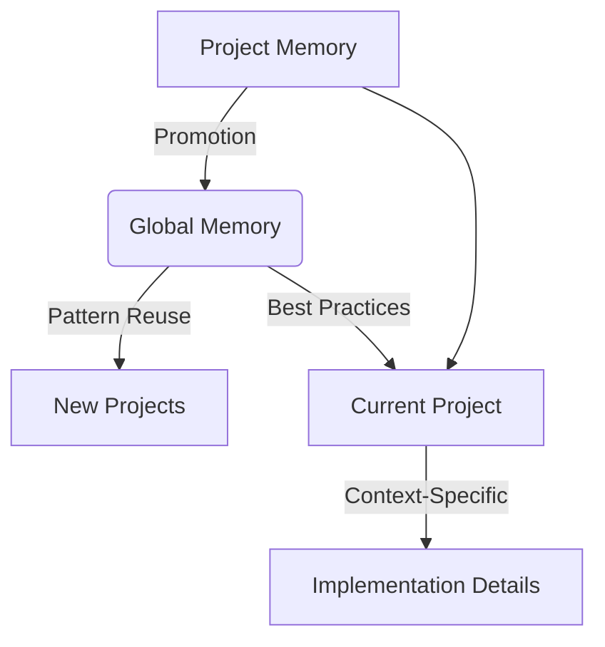
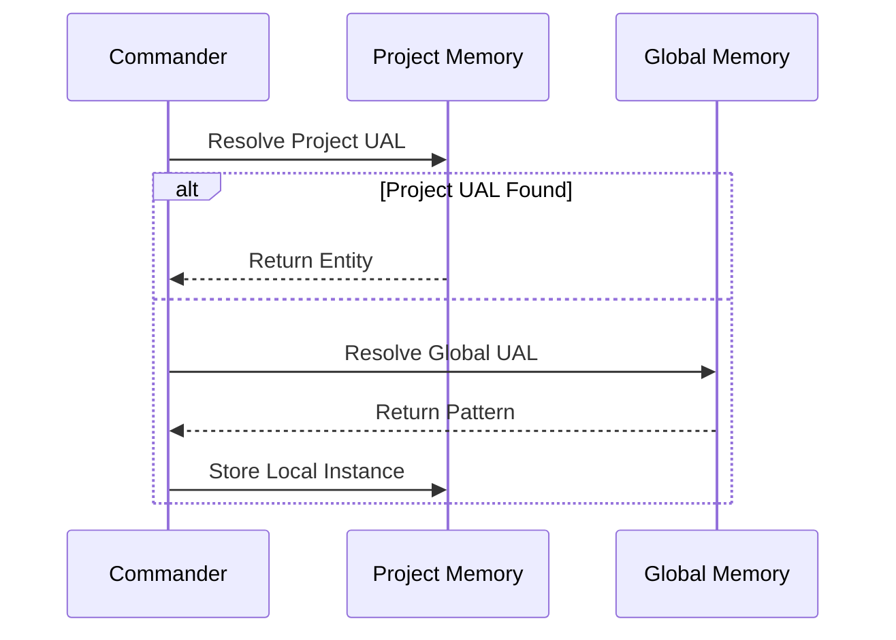

# Memory Consolidation Architecture

## Dual Memory System


## UAL Resolution Sequence


## Cryptographic Verification
```python
def verify_memory_integrity(entity):
    content = json.dumps(entity, sort_keys=True)
    computed_hash = hashlib.sha256(content.encode()).hexdigest()
    return computed_hash == entity['integrity_hash']
```

## Promotion Workflow
1. **Validation**: Verify pattern meets reuse criteria
2. **Normalization**: Standardize pattern structure
3. **Versioning**: Apply global version scheme
4. **Chaining**: Link to source project version
5. **Verification**: Generate integrity hash
6. **Promotion**: Add to global memory

## Performance Metrics
| Operation | Avg Time | 95th %ile |
|-----------|----------|-----------|
| Local Lookup | 12ms | 25ms |
| Global Lookup | 45ms | 85ms |
| Pattern Promotion | 320ms | 520ms |
| Integrity Check | 8ms | 15ms |

## Recent Enhancements
- SHA-256 cryptographic verification
- Version chaining across memory systems
- Batch promotion operations
- Automatic dependency resolution