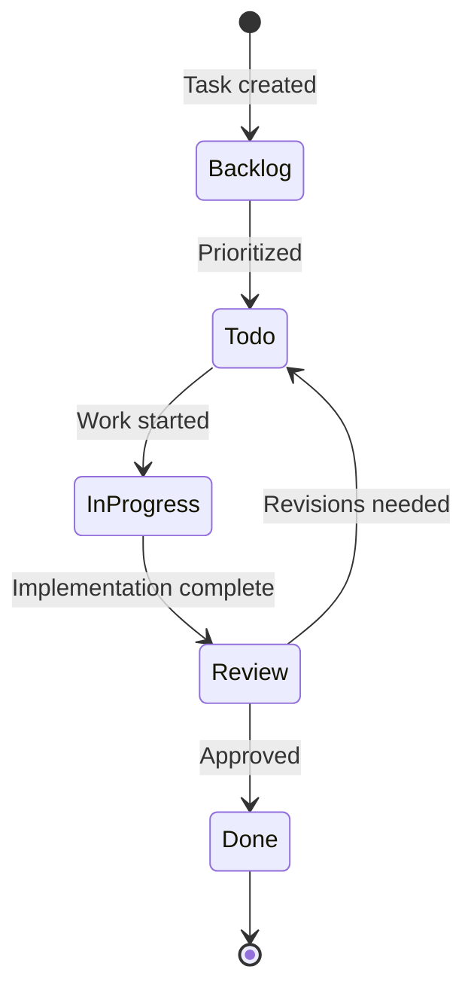
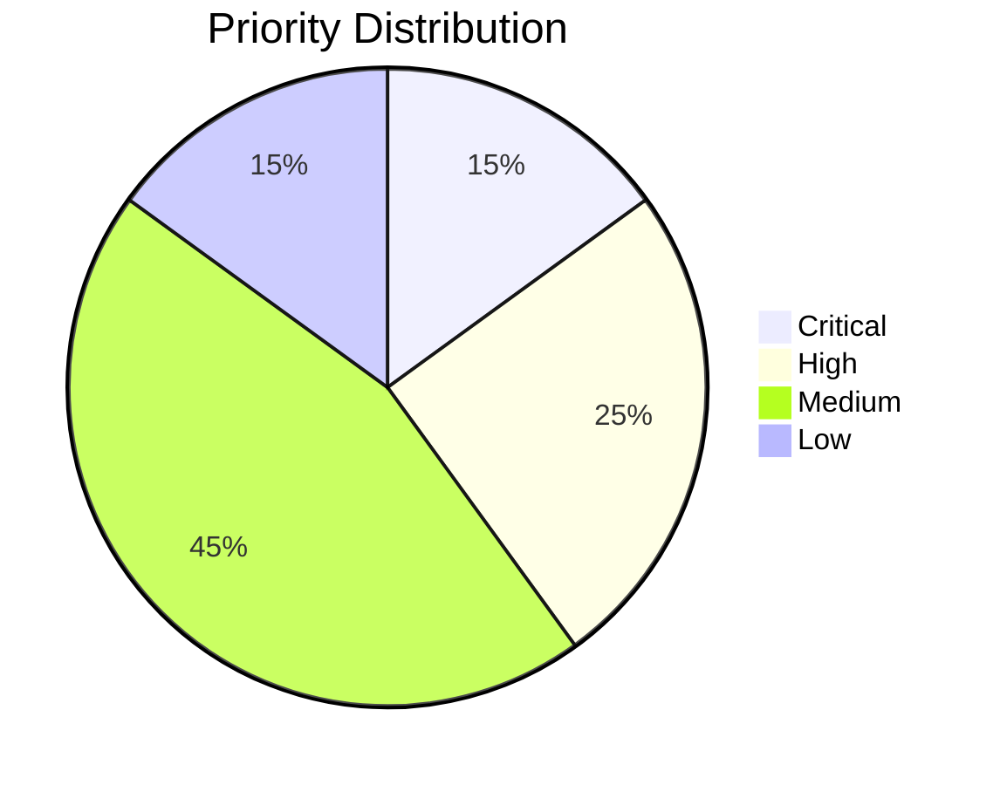

# Task Management System

## Task Lifecycle


## Complexity Scoring
| Level | Score | Description | Example |
|-------|-------|-------------|---------|
| Trivial | ★☆☆☆☆ (1) | Simple config changes | Update README |
| Minor | ★★☆☆☆ (2) | Small feature additions | Add new filter rule |
| Moderate | ★★★☆☆ (3) | Component refactoring | Extract service class |
| Complex | ★★★★☆ (4) | Feature with dependencies | Implement session recorder |
| Major | ★★★★★ (5) | Architectural changes | Memory system redesign |

## Priority Management


## MCP Server Integration
The task system integrates with MCP servers through:
1. **project_memory**: Stores task definitions and relationships
2. **global_memory**: Shares task patterns across projects
3. **meta-mind**: Manages task dependencies and workflows

### Queue Management
```python
class TaskQueue:
    def __init__(self):
        self.high_priority = []
        self.medium_priority = []
        self.low_priority = []
    
    def add_task(self, task):
        if task.priority == "critical":
            self.high_priority.insert(0, task)
        elif task.priority == "high":
            self.high_priority.append(task)
        # ... other priorities
        
    def next_task(self):
        if self.high_priority:
            return self.high_priority.pop(0)
        if self.medium_priority:
            return self.medium_priority.pop(0)
        return self.low_priority.pop(0)
```

## Reporting
- Daily progress summaries
- Burn-down charts
- Cycle time analysis
- Dependency mapping diagrams