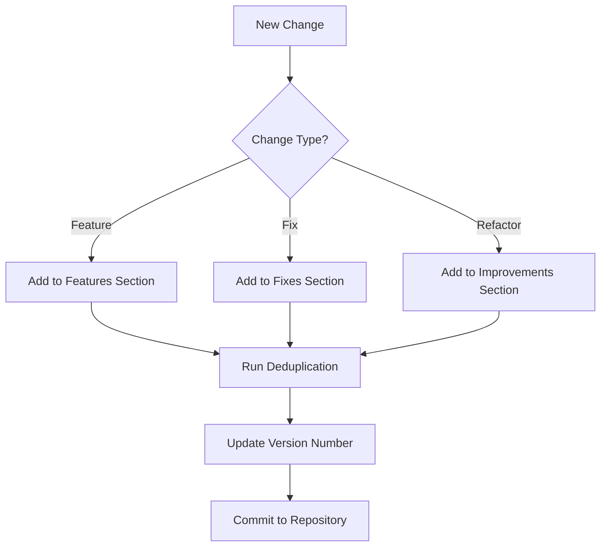

# Changelog Management System

## Overview
Centralized system for tracking project changes with automated deduplication and versioning.

## Key Features
- **Automated Deduplication**: Uses content-based hashing to eliminate duplicate entries
- **Semantic Versioning**: Adheres to `MAJOR.MINOR.PATCH` versioning scheme
- **Change Categorization**:
  - `[FEATURE]`: New functionality
  - `[FIX]`: Bug resolutions
  - `[REFACTOR]`: Code improvements
  - `[DOCS]`: Documentation updates

## Maintenance Workflow

## Deduplication Process
1. Generate SHA-256 hash of new entry
2. Compare against existing change hashes
3. Merge duplicates while preserving metadata
4. Maintain version history of merged changes

## Best Practices
- Add entries immediately after completing work
- Include issue tracker references where applicable
- Use imperative mood ("Add feature" not "Added feature")