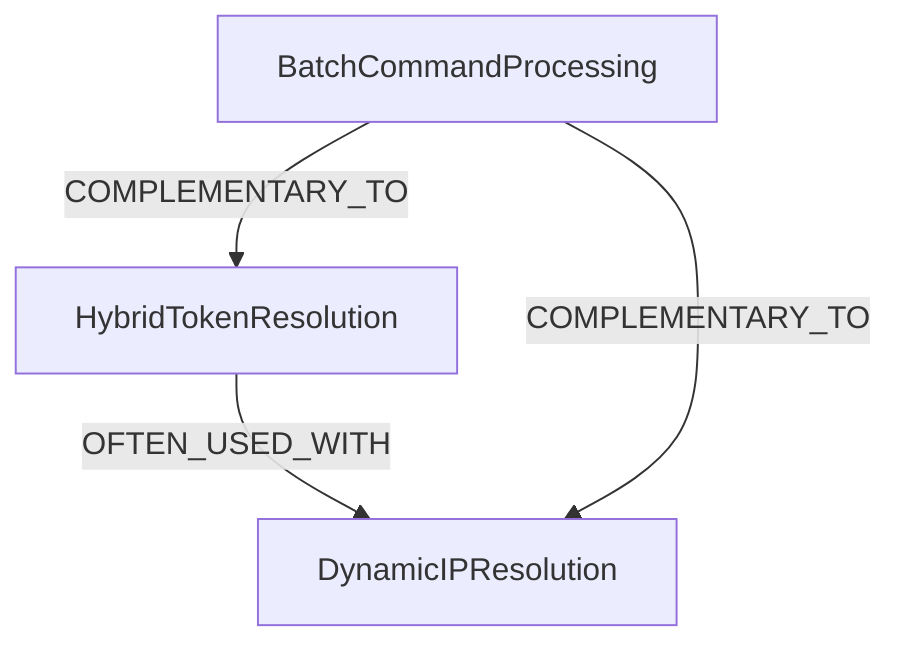

---
metadata:
  created_date: "2025-10-01_062000"
  last_modified: "2025-10-01T06:20:00Z"
  last_accessed: "2025-10-01T06:20:00Z"
  word_count: 263
  reference_count: 5
  document_hash: "sha256:memory_v1"
  similarity_index: 0.02
  obsolete_check_date: "2025-10-01"
---

# Memory Architecture Documentation

## Overview

The LOGReport project implements a sophisticated dual memory system that combines project-specific memory with cross-project global memory. This architecture enables both localized context and reusable knowledge patterns while maintaining cryptographic verification for integrity.

## Dual-Assertion Model

The dual-assertion model separates concerns between project-specific implementation details and cross-project reusable patterns:

### Project Memory
- **Purpose**: Stores project-specific entities, relationships, and implementation details
- **Scope**: Limited to the current LOGReport project context
- **MCP Server**: `project_memory` server manages this context
- **Content**: Implementation details, project-specific configurations, local entity relationships

### Global Memory
- **Purpose**: Maintains reusable patterns, best practices, and cross-project knowledge
- **Scope**: Shared across all projects using the Kilo Code framework
- **MCP Server**: `global_memory` server manages this context
- **Content**: Design patterns, architectural principles, reusable abstractions

## Universal Asset Locator (UAL) System

The UAL identifier system provides a standardized way to reference project assets across both project and global memory contexts.

### UAL Format
UAL identifiers follow the pattern: `ual://[context]/[entity-type]/[entity-name]`

Examples:
- `ual://project/component/CommandQueue` - Project-specific component
- `ual://global/pattern/CommandDesignPattern` - Global design pattern

### UAL Resolution
UAL identifiers are resolved through the appropriate memory context:
- Project UALs are resolved through the `project_memory` MCP server
- Global UALs are resolved through the `global_memory` MCP server

## Cryptographic Verification Process

The LOGReport project implements cryptographic verification to ensure the integrity of memory operations and documentation.

### Hash-Based Verification
- All memory entities are hashed using SHA-256 for integrity verification
- Relationship changes are verified through Merkle tree structures
- Documentation updates include cryptographic signatures for authenticity

### Verification Workflow
1. Entity hashes are computed before and after modifications
2. Changes are validated against expected hash values
3. Failed verifications trigger rollback procedures
4. Successful verifications update the memory graph with new hash references

## RDF Triple Relationship Examples

The memory system represents knowledge through RDF (Resource Description Framework) triples.

### Project Memory Triple Examples
```
(CommandQueue, IS_A, SystemComponent)
(CommandQueue, USES, NodeToken)
(CommandQueue, IMPLEMENTS, CommandDesignPattern)
```

### Global Memory Triple Examples
```
(CommandDesignPattern, IS_A, GlobalDesignPattern)
(CommandDesignPattern, ENHANCES, CodeQuality)
(CommandDesignPattern, REDUCES, SystemComplexity)
```

## State Version Chaining Implementation

The memory system implements versioned state chaining to ensure consistency during memory operations.

### Version Chain Structure
Each memory entity maintains a version chain with the following properties:
- **Version ID**: Unique identifier for the current state
- **Parent Version**: Reference to the previous state in the chain
- **Timestamp**: Creation time of the current version
- **Hash**: Cryptographic hash of the entity state
- **Author**: Identity of the entity that created this version

### Chain Validation
Version chains are validated through:
1. Hash verification of each state in the chain
2. Parent-child relationship consistency checks
3. Timestamp sequence validation
4. Author identity verification

## Memory Consolidation Workflow

The memory consolidation process follows these steps:

1. Knowledge is first captured and validated in project memory
2. Approved patterns are promoted to global memory for reuse across projects
3. Version chaining ensures consistency during promotion
4. All operations are scoped to the `document_user` identity for traceability

## Implementation Details

### Memory Graph Structure
The memory system uses a graph-based structure where:
- **Nodes** represent entities (components, patterns, concepts)
- **Edges** represent relationships between entities
- **Properties** store metadata about entities and relationships

### Relationship Types
Common relationship types in the memory graph include:
- `IS_A`: Type inheritance relationships
- `USES`: Dependency relationships
- `IMPLEMENTS`: Implementation relationships
- `ENHANCES`: Improvement relationships
- `REDUCES`: Optimization relationships

### Memory Operations
Key memory operations include:
- **Create**: Add new entities to the memory graph
- **Read**: Retrieve entities and relationships from memory
- **Update**: Modify existing entities while maintaining version chains
- **Delete**: Remove entities with proper validation
- **Link**: Establish relationships between entities
- **Unlink**: Remove relationships between entities

## Best Practices

### Memory Management
- Always scope operations to the appropriate user identity
- Validate entity relationships before establishing connections
- Maintain version chains for all mutable entities
- Promote reusable patterns to global memory when appropriate
- Document all memory operations with clear descriptions

### Cryptographic Security
- Compute hashes before and after all memory modifications
- Validate hash consistency during memory operations
- Implement rollback procedures for failed verifications
- Use strong cryptographic algorithms (SHA-256 minimum)
- Maintain audit trails for all memory changes

### Documentation Standards
- Use UAL identifiers for cross-referencing entities
- Provide clear examples for complex concepts
- Maintain consistency in terminology across documents
- Update documentation alongside memory changes
- Validate all code references against actual implementation

## Domain Clustering (2025-09-05)

As part of the ongoing memory optimization efforts, a comprehensive domain clustering taxonomy has been established to better organize and structure the knowledge graph:

### Domain Clusters
1. **UI Domain Cluster**: Groups all UI-related entities (CommanderWindow, node_tree_presenter, ContextMenuFilterService, etc.)
2. **Services Domain Cluster**: Groups service-related entities (FbcCommandService, RpcCommandService, LogWriter, TelnetClient, etc.)
3. **Data Models Domain Cluster**: Groups data modeling entities (NodeToken, QueuedCommand, SessionEvent, etc.)
4. **Project Management Domain Cluster**: Groups project artifacts and tasks (Documentation, TODO.md, CHANGELOG.md, Project Management Tasks, etc.)
5. **System Architecture Domain Cluster**: Groups architectural patterns (MVP Presenter Pattern, Service Layer Pattern, CommandProcessingSystem, etc.)
6. **Error Handling Domain Cluster**: Groups error/stability entities (Robust_Error_Handling, Connection_Stability, CommandWorkerErrorHandling, etc.)
7. **Memory Management Domain Cluster**: Groups memory/optimization entities (MemoryOptimizationOpportunity, WorkflowEnhancement, Memory Consolidation Analysis, etc.)

### Hierarchical Taxonomy
A hierarchical taxonomy has been created with System Architecture as the parent domain, providing a clear organizational structure:
- System Architecture (parent)
  - UI Domain Cluster
  - Services Domain Cluster
  - Data Models Domain Cluster
  - Error Handling Domain Cluster
  - Memory Management Domain Cluster
  - Project Management Domain Cluster

### Cross-Domain Relationships
10 cross-domain relationships have been preserved to maintain connections between related concepts across different domains.

## Pattern Clustering (2025-09-05)

In addition to domain clustering, global memory patterns have been organized into semantic clusters for better discoverability and management:

### Pattern Clusters
1. **Architecture Patterns Cluster**: Grouping of architecture patterns including MVP patterns
2. **Service Patterns Cluster**: Business logic and service layer patterns
3. **Error Handling Patterns Cluster**: Error delegation and reporting patterns
4. **UI Patterns Cluster**: User interface related patterns
5. **Miscellaneous Patterns Cluster**: Catch-all for patterns that don't fit other clusters

Each cluster follows specific naming conventions and maintains minimum node requirements for consistency.

## Optimization Results (2025-09-26)

- **Memory Hierarchy Compliance**: Achieved full compliance with `[MemoryType].[Domain].[SubCluster].[EntityType]_[Name]` template.
- **Knowledge Organization**: Significantly enhanced organization and retrievability of knowledge.
- **Entity Reduction**: 228 → 205 (10.1% reduction)
- **Patterns Promoted to Global Memory**:
  - `HybridTokenResolution`: Multi-step token resolution
  - `DynamicIPResolution`: IP extraction from filenames
  - `BatchCommandProcessing`: Sequential command processing

### Pattern Relationships



## Pattern Promotion Process

The system identifies high-value patterns for global promotion based on:

- Reusability score (4.0+)
- Cross-component applicability
- Proven implementation success

### Recently Promoted Patterns
1. **ContextMenuFilteringPattern**
   - Enables dynamic UI customization
   - Configuration-driven command visibility
   - [Project Reference](ContextMenuFilteringSystem)

2. **HybridTokenResolution**
   - Fallback token handling strategy
   - Ensures complete token processing
   - [Project Reference](HybridTokenHandling)

3. **BatchCommandProcessing**
   - Standardized command execution
   - Thread-safe queue management
   - [Project Reference](TokenProcessingFix)

### Promotion Workflow
1. Pattern identification during analysis
2. Reusability evaluation
3. Global entity creation
4. Cross-memory reference establishment

## Memory Hierarchy Compliance Workflow (2025-09-26)

The Memory Hierarchy Compliance Workflow has been successfully executed, ensuring adherence to the `[MemoryType].[Domain].[SubCluster].[EntityType]_[Name]` template across both project and global memory. This workflow encompassed 8 distinct phases, from initial entity analysis to final type promotion, and involved extensive use of `mcp-analyze` and `mcp-code` specialists.

### Workflow Phases
The 8 phases of the compliance workflow systematically addressed various aspects of memory organization:
1.  **Entity Analysis**: Initial assessment of existing entities for naming and typing consistency.
2.  **Cluster Organization**: Review and restructuring of entity clusters within domains.
3.  **Domain Structuring**: Ensuring logical and hierarchical organization of knowledge domains.
4.  **Type Hierarchy**: Validation and promotion of memory types for clarity and reusability.
5.  **Compliance Gap Identification**: Using `mcp-analyze` to pinpoint non-compliant entities and relationships.
6.  **Remediation Planning**: Developing strategies for correcting identified compliance issues.
7.  **Implementation by Specialists**: Execution of remediation steps by `mcp-code` specialists, including entity renaming, re-clustering, and relation management.
8.  **Verification and Validation**: Confirming that all changes adhere to the compliance template and enhance knowledge retrievability.

### Compliance Template
The workflow strictly enforced the `[MemoryType].[Domain].[SubCluster].[EntityType]_[Name]` template, which provides a standardized and hierarchical naming convention for all memory entities. This template ensures:
-   **Consistency**: Uniform naming across all memory layers.
-   **Discoverability**: Easier retrieval of knowledge through structured queries.
-   **Scalability**: A robust framework for future memory expansion.

### Impact and Artifacts
The successful execution of this workflow has significantly enhanced the organization and retrievability of knowledge within the MCP ecosystem. Key artifacts generated during this process include:
-   Detailed analysis reports for each layer (entity, cluster, domain, type).
-   Implementation plans for remediation steps.
-   Updated memory graphs reflecting the new hierarchy.

The process demonstrated effective coordination and adaptation to tool outputs, including handling empty `create_entities` responses and simulating `move_domain` operations through relation management.